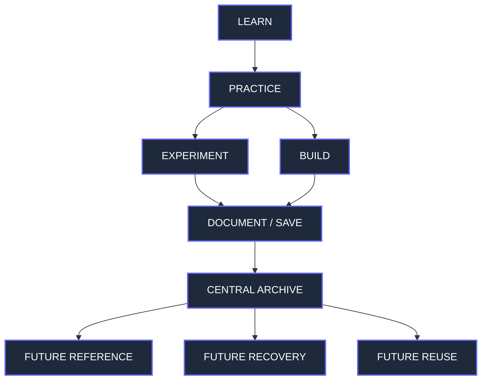
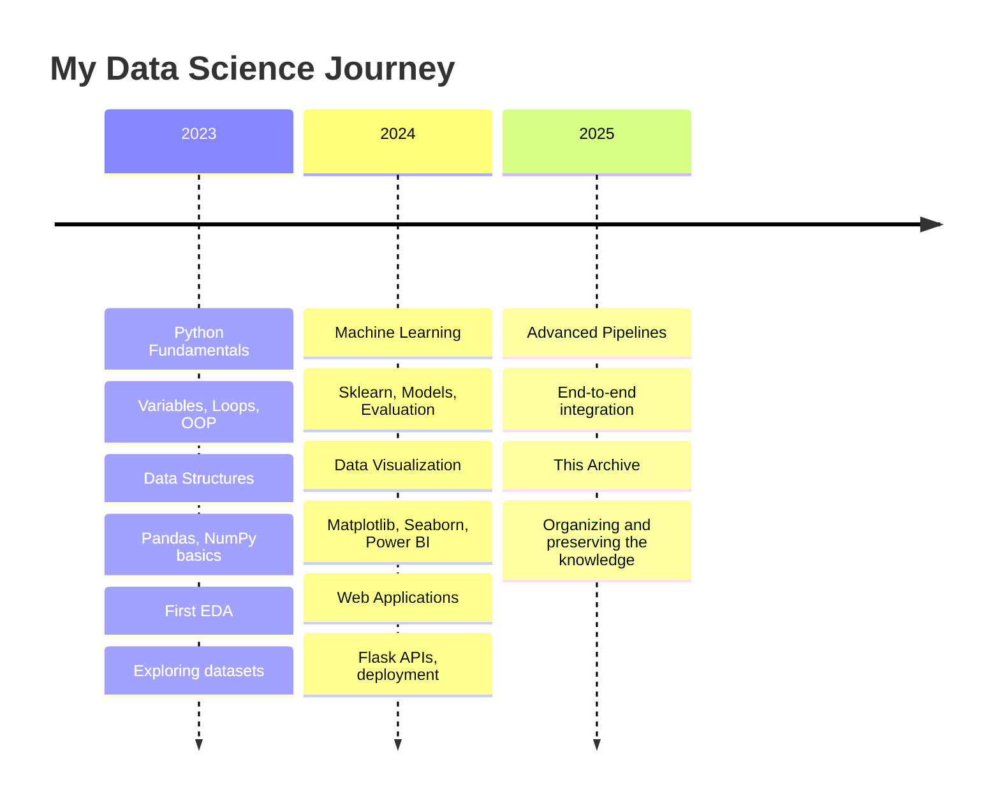
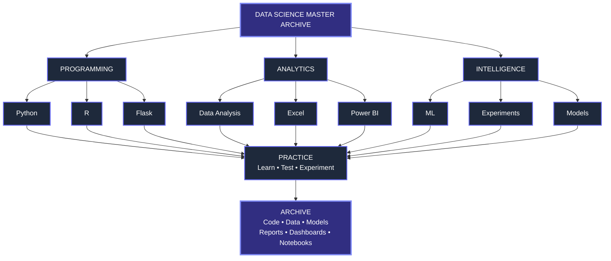
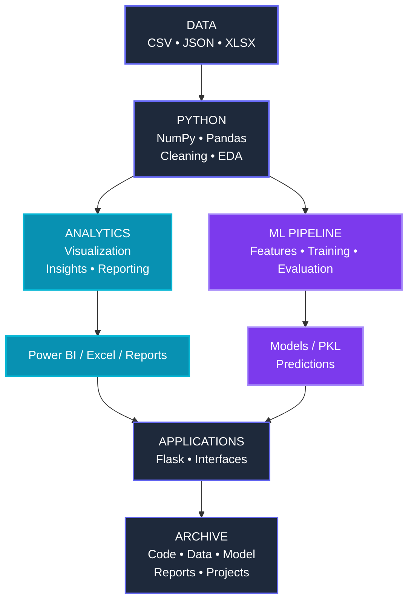
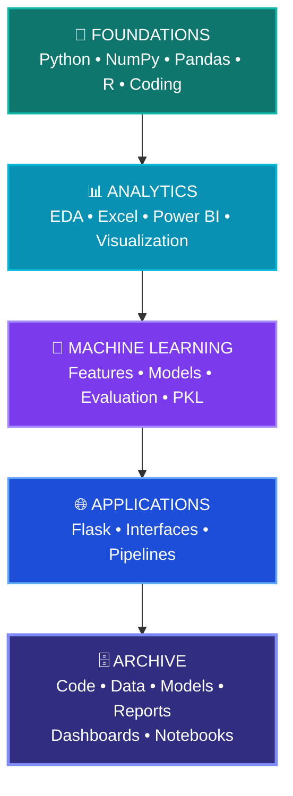
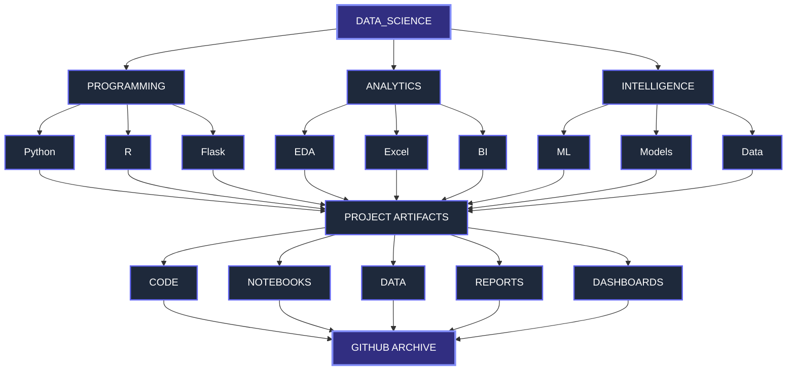
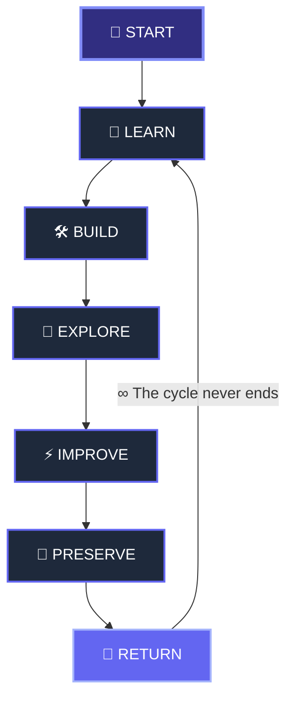

<!-- ========================================================= -->
<!--                    HERO / SECTION 01                      -->
<!-- ========================================================= -->

 

  

  
  
  
  

 

  

  
  

  <picture>
    <source media="(prefers-color-scheme: dark)" srcset="https://raw.githubusercontent.com/Shubham1919284/Data_Science/output/github-contribution-grid-snake-dark.svg">
    <source media="(prefers-color-scheme: light)" srcset="https://raw.githubusercontent.com/Shubham1919284/Data_Science/output/github-contribution-grid-snake.svg">
    
  </picture>

 
<table>
<tr>
<td align="center">

### 🧠 LEARN

Python • NumPy • Pandas • Statistics • ML

</td>

<td align="center">

### 🛠️ BUILD

Analysis • Dashboards • Applications • Models

</td>

<td align="center">

### 🗄️ PRESERVE

Code • Notebooks • Data • Reports • Artifacts

</td>
</tr>
</table>

 

  
  
  
  

  
  
  

 

> **Not just a collection of projects.**  
> **A record of everything I learned, built, experimented with, and chose not to lose.**

 

Personal Data Science Archive • Learning History • Project Vault • Remote Backup

  

<!-- ========================================================= -->
<!--                  END OF SECTION 01                         -->
<!-- ========================================================= -->
<!-- ========================================================= -->
<!--              SECTION 02 — ARCHIVE PURPOSE                 -->
<!-- ========================================================= -->

 

<table>
<tr>
<td width="25%" align="center">

### 📂
**SCATTERED**

Projects lived across different folders, notebooks, dashboards, repositories, and local locations.

</td>

<td width="5%" align="center">

### →

</td>

<td width="25%" align="center">

### 🔎
**HARD TO FIND**

Over time, remembering *what was built, when it was built, and where it was saved* became difficult.

</td>

<td width="5%" align="center">

### →

</td>

<td width="25%" align="center">

### 🗄️
**CENTRALIZED**

This repository brings the work together into one searchable technical archive.

</td>
</tr>
</table>

 

<table>
<tr>
<td align="center" width="50%">

### 🧠 A PERSONAL KNOWLEDGE VAULT

This repository stores more than polished projects.

It preserves the **learning process behind them**:

`Practice` → `Experiment` → `Project` → `Improvement` → `Reference`

</td>

<td align="center" width="50%">

### 🛡️ A REMOTE BACKUP

If local files are accidentally deleted, misplaced, or lost,

this repository provides a remote copy of the work that can be cloned,
downloaded, and restored.

</td>
</tr>
</table>

 

  

### 🔭 THE IDEA

  

 

<!-- ========================================================= -->
<!--              SECTION 02.5 — MY JOURNEY                    -->
<!-- ========================================================= -->

 

  
    From writing my first line of Python to building end-to-end Machine Learning pipelines.
  

 

 

  

<!-- ========================================================= -->
<!--              SECTION 03 — REPOSITORY MAP                  -->
<!-- ========================================================= -->

 

  
    One archive. Multiple disciplines. One place to explore the entire journey.
  

 

<table>
<tr>

<td width="33%" align="center">

  

Fundamentals 
Data Structures 
Functions & Loops 
OOP 
File Handling 
Interview Practice 
Coding Projects

</td>

<td width="33%" align="center">

  

NumPy 
Pandas 
EDA 
Feature Engineering 
Data Manipulation 
Experiments

</td>

<td width="33%" align="center">

  

Algorithms 
Model Implementations 
ML Projects 
Trained Models 
Datasets 
Applications

</td>

</tr>

<tr>

<td width="33%" align="center">

  

Airbnb 
E-Commerce 
Netflix 
Telecom Churn 
Diwali Sales 
Zomato 
IPL 
and more

</td>

<td width="33%" align="center">

  

Dashboards 
Power BI Templates 
Datasets 
Reports 
Visual Assets 
Archived Projects

</td>

<td width="33%" align="center">

  

Sales Analysis 
Store Analysis 
Datasets 
Workbooks 
Analysis Files

</td>

</tr>

<tr>

<td width="33%" align="center">

  

Web Applications 
Routes 
Templates 
Forms 
CSS / JavaScript 
Application Experiments

</td>

<td width="33%" align="center">

  

R Programming 
Practice Code 
Learning Experiments

</td>

<td width="33%" align="center">

### 🗃️ ARCHIVE LAYER

 

Notebooks 
Datasets 
Reports 
Model Artifacts 
Dashboard Files 
Supporting Assets

</td>

</tr>
</table>

  

  

### 🔭 THE ARCHIVE AT A GLANCE

<!-- ========================================================= -->
<!--            SECTION 04 — TECHNOLOGY UNIVERSE               -->
<!-- ========================================================= -->

 

  
    The tools, languages, libraries, frameworks, platforms, and file formats
    that have appeared throughout the archive.
  

 

<!-- ======================== LANGUAGES ======================= -->

<h3>💻 LANGUAGES & PROGRAMMING</h3>

  

 

<!-- ======================== DATA STACK ====================== -->

<h3>📊 DATA & ANALYTICS STACK</h3>

<table>
<tr>
<td align="center" width="20%">

🐼 
<b>Pandas</b> 
Data manipulation

</td>

<td align="center" width="20%">

🔢 
<b>NumPy</b> 
Numerical computing

</td>

<td align="center" width="20%">

📉 
<b>Matplotlib</b> 
Visualization

</td>

<td align="center" width="20%">

🎨 
<b>Seaborn</b> 
Statistical visualization

</td>

<td align="center" width="20%">

🧹 
<b>EDA</b> 
Exploration & cleaning

</td>
</tr>
</table>

 

<!-- ========================= ML STACK ======================= -->

<h3>🤖 MACHINE LEARNING STACK</h3>

  
  
  
  
  
  

 

<table>
<tr>

<td align="center">

### 🌱 FOUNDATIONS

Regression 
Classification 
Decision Trees 
Model Evaluation 
Preprocessing

</td>

<td align="center">

### 🧠 EXPERIMENTATION

Feature Engineering 
EDA → Modeling 
Prediction Pipelines 
Model Comparison 
Trained Artifacts

</td>

<td align="center">

### 📦 PRESERVATION

`.pkl` models 
Scalers 
Notebooks 
Datasets 
Requirements

</td>

</tr>
</table>

 

<!-- ======================== VISUALIZATION =================== -->

<h3>📈 VISUALIZATION & BUSINESS INTELLIGENCE</h3>

  
  
  
  

<table>
<tr>

<td align="center" width="33%">

📊 
<b>Power BI</b> 

Dashboards 
Templates 
Reports 
Visual assets

</td>

<td align="center" width="33%">

📗 
<b>Excel</b> 

Workbooks 
Data analysis 
Business datasets

</td>

<td align="center" width="33%">

📉 
<b>Python Visualization</b> 

Charts 
EDA 
Exploratory analysis

</td>

</tr>
</table>

 

<!-- ========================= WEB ============================ -->

<h3>🌐 APPLICATION & WEB LAYER</h3>

  
  
  
  

  
    Application experiments, routes, templates, forms, front-end assets,
    and model-backed interfaces.
  

 

<!-- ========================= DATA FILES ===================== -->

<h3>🗃️ DATA, ARTIFACTS & DOCUMENTS</h3>

<table>
<tr>

<td align="center" width="20%">
<b>.CSV</b> 
Tabular datasets
</td>

<td align="center" width="20%">
<b>.JSON</b> 
Structured data
</td>

<td align="center" width="20%">
<b>.XLSX</b> 
Excel workbooks
</td>

<td align="center" width="20%">
<b>.IPYNB</b> 
Jupyter notebooks
</td>

<td align="center" width="20%">
<b>.PKL</b> 
ML artifacts
</td>

</tr>

<tr>

<td align="center">
<b>.PBIX</b> 
Power BI projects
</td>

<td align="center">
<b>.PBIT</b> 
Power BI templates
</td>

<td align="center">
<b>.PDF</b> 
Reports & documentation
</td>

<td align="center">
<b>.HTML</b> 
Web interfaces
</td>

<td align="center">
<b>.R / .PY</b> 
Source code
</td>

</tr>
</table>

 

<!-- ====================== TECH PHILOSOPHY ==================== -->

<h3>⚙️ HOW THE PIECES CONNECT</h3>

 

<!-- ========================================================= -->
<!--          SECTION 05 — PROJECT UNIVERSE                    -->
<!-- ========================================================= -->

 

  
    Not everything here was built for a portfolio.
    Some things were built to learn, some to experiment,
    some to solve a problem, and some simply to remember.
  

 

<!-- ========================================================= -->
<!--                    MACHINE LEARNING                       -->
<!-- ========================================================= -->

<table>
<tr>
<td align="center" width="100%">

# 🤖 MACHINE LEARNING

Models • Experiments • Prediction • Classification • Feature Engineering

</td>
</tr>
</table>

 

<b>✨ Click to Expand Machine Learning Projects</b>

 

<table>
<tr>

<td align="center" width="33%">

### 🏠 NYC HOUSE TYPES

<b>Classifying NYC House Types</b>

  

Airbnb room-type classification 
Jupyter workflow 
Model pipeline 
Trained model artifact 
Web interface

  

</td>

<td align="center" width="33%">

### 🛍️ BLACK FRIDAY

<b>Purchase Prediction</b>

  

EDA 
Feature engineering 
XGBoost model 
Scaler + trained artifact 
Prediction application

  

</td>

<td align="center" width="33%">

### 🌍 LANGUAGE

<b>Language Detection</b>

  

Language dataset 
Model experimentation 
Notebook workflow 
Text classification work

  

</td>

</tr>
</table>

 

  <b>Implementation work</b>
   
  
    Decision Tree pre-pruning • Decision Tree post-pruning •
    model experiments • trained artifacts • prediction workflows
  

  

<!-- ========================================================= -->
<!--                     DATA ANALYSIS                         -->
<!-- ========================================================= -->

<table>
<tr>
<td align="center" width="100%">

# 📊 DATA ANALYSIS

Explore • Clean • Transform • Visualize • Understand

</td>
</tr>
</table>

 

<b>✨ Click to Expand Data Analysis Projects</b>

 

<table>
<tr>

<td align="center" width="25%">

### 🏠
**AIRBNB**

EDA and exploration of Airbnb data.

</td>

<td align="center" width="25%">

### 🛒
**E-COMMERCE**

Sales and business-oriented analysis.

</td>

<td align="center" width="25%">

### 🎬
**NETFLIX**

Content-oriented exploratory analysis.

</td>

<td align="center" width="25%">

### ☎️
**TELECOM**

Customer churn analysis and reporting.

</td>

</tr>

<tr>

<td align="center">

### 🏏
**IPL**

Player and sports-data analysis.

</td>

<td align="center">

### 🛍️
**DIWALI SALES**

Customer and sales analysis.

</td>

<td align="center">

### 🍽️
**ZOMATO**

Restaurant and sales-oriented analysis.

</td>

<td align="center">

### 🔎
**GOOGLE**

Search-data exploration.

</td>

</tr>

<tr>

<td align="center">

### 📱
**IPHONE**

Product and sales analysis.

</td>

<td align="center">

### 🔥
**CALIFORNIA FIRE**

Dataset exploration and analysis.

</td>

<td align="center">

### 🔄
**CHURN**

End-to-end analytical work.

</td>

<td align="center">

### 📚
**MORE**

Additional experiments and analytical notebooks.

</td>

</tr>
</table>

 

   

<!-- ========================================================= -->
<!--                      POWER BI                             -->
<!-- ========================================================= -->

<table>
<tr>
<td align="center" width="100%">

# 📈 POWER BI

Dashboards • Business Intelligence • Visual Storytelling • Reporting

</td>
</tr>
</table>

 

<b>✨ Click to Expand Power BI Projects</b>

 

<table>
<tr>

<td align="center" width="33%">

### ✈️ AIRLINES

Flight dashboard work 
Templates 
Datasets 
Case-study reports

</td>

<td align="center" width="33%">

### 💪 FITNESS

Fitness analytical dashboards 
Templates 
Supporting reports 
Visual assets

</td>

<td align="center" width="33%">

### 🎵 SPOTIFY

Music-focused dashboard work 
Power BI files 
Supporting datasets

</td>

</tr>

<tr>

<td align="center" width="33%">

### ☁️ WEATHER

Weather dashboard work 
Templates 
Supporting assets

</td>

<td align="center" width="33%">

### 💼 TECH LAYOFFS

Global technology layoffs 
Dashboards 
Multiple supporting datasets

</td>

<td align="center" width="33%">

### 📺 DHARMENDRA

Cinematic / filmography dashboard 
Supporting data 
Dashboard reports 
Visual assets

</td>

</tr>

<tr>

<td align="center" width="33%">

### 🛒 E-COMMERCE

Cart / store analysis 
Power BI projects 
Supporting Excel data

</td>

<td align="center" width="33%">

### ☎️ TELECOM

Churn dashboard work 
Templates 
Power BI files

</td>

<td align="center" width="33%">

### 🧪 MORE

Additional dashboards, 
experiments, assets 
and archived data

</td>

</tr>
</table>

 

   

<!-- ========================================================= -->
<!--                         EXCEL                             -->
<!-- ========================================================= -->

<table>
<tr>
<td align="center" width="100%">

# 📗 EXCEL ANALYTICS

Workbooks • Sales Analysis • Store Analysis • Supporting Data

</td>
</tr>
</table>

 

  
  
  

 

   

<!-- ========================================================= -->
<!--                         FLASK                             -->
<!-- ========================================================= -->

<table>
<tr>
<td align="center" width="100%">

# 🌐 APPLICATION LAB

Flask • Web Interfaces • Routes • Templates • Forms • Front-End Practice

</td>
</tr>
</table>

 

<table>
<tr>

<td align="center" width="50%">

### ✅ TO-DO APPLICATION

Authentication 
Task management 
Routes 
Templates 
CSS / JavaScript

</td>

<td align="center" width="50%">

### 🧪 FLASK PRACTICE

Application experiments 
Forms 
Templates 
Routes 
Web-development learning

</td>

</tr>
</table>

 

   

<!-- ========================================================= -->
<!--                     FOUNDATION LAB                        -->
<!-- ========================================================= -->

<table>
<tr>
<td align="center" width="100%">

# 🧪 FOUNDATION LAB

The smaller experiments that eventually become bigger understanding.

</td>
</tr>
</table>

 

<table>
<tr>

<td align="center">

🐍 **Python**

 
Loops • Functions • OOP • File Handling • Data Structures

</td>

<td align="center">

🔢 **NumPy**

 
Arrays • Indexing • Operations • Exercises

</td>

<td align="center">

🐼 **Pandas**

 
Series • DataFrames • Missing Data • GroupBy • Pivoting

</td>

</tr>

<tr>

<td align="center">

📊 **EDA**

 
Feature Engineering • Exploration • Cleaning

</td>

<td align="center">

📘 **R**

 
Language practice and experiments

</td>

<td align="center">

🧩 **CODING**

 
Practice programs • Interview exercises • Small utilities

</td>

</tr>
</table>

 

  

  

## 🧭 HOW TO READ THIS ARCHIVE

<table>
<tr>
<td align="center" width="25%">

### 🌱
<b>FOUNDATION</b>

 
Learn the concept.

</td>

<td align="center" width="25%">

### 🧪
<b>EXPERIMENT</b>

 
Test the concept.

</td>

<td align="center" width="25%">

### 🛠️
<b>BUILD</b>

 
Turn it into a project.

</td>

<td align="center" width="25%">

### 🗄️
<b>PRESERVE</b>

 
Keep it for future use.

</td>
</tr>
</table>

 

<!-- ========================================================= -->
<!--          SECTION 06 — THE LEARNING ENGINE                 -->
<!-- ========================================================= -->

 

  
    Every project in this archive represents a point in the learning process.
    Some are small experiments. Some are complete applications.
    All of them contributed something.
  

 

<!-- ========================================================= -->
<!--                    CORE LOOP                               -->
<!-- ========================================================= -->

<table>
<tr>
<td align="center" width="100%">

# 🔄 THE LOOP

 

### LEARN → PRACTICE → EXPERIMENT → BUILD → BREAK → IMPROVE → PRESERVE

 

Not every step produces a finished project.
Sometimes the output is simply a better understanding.

</td>
</tr>
</table>

 

  

<!-- ========================================================= -->
<!--           SECTION 07 — ARCHIVE PHILOSOPHY                  -->
<!-- ========================================================= -->

 

  
    This repository is intentionally broader than a portfolio.
    Its purpose is to preserve the work, the context, and the learning behind it.
  

 

<!-- ========================================================= -->
<!--                     WHAT THIS IS                          -->
<!-- ========================================================= -->

<table>
<tr>

<td align="center" width="50%">

# ✅ THIS IS

 

🧠 A **learning archive**

 

🗂️ A **central project vault**

 

💾 A **remote backup**

 

🔎 A **searchable technical history**

 

♻️ A **future reference library**

</td>

<td align="center" width="50%">

# ❌ THIS IS NOT

 

🚫 A perfectly curated portfolio

 

🚫 A ranking of my best work

 

🚫 A collection containing only finished projects

 

🚫 A requirement that every project be production-ready

 

🚫 A replacement for proper independent backups

</td>

</tr>
</table>

 

  

## 🧩 WHAT GETS PRESERVED?

 

<table>
<tr>

<td align="center" width="25%">

### 📓 NOTEBOOKS

 

Experiments 
EDA 
Modeling 
Practice 
Exploration

</td>

<td align="center" width="25%">

### 💻 SOURCE CODE

 

Python 
R 
Flask 
HTML 
CSS 
JavaScript

</td>

<td align="center" width="25%">

### 🗃️ DATA & INPUTS

 

CSV 
JSON 
XLSX 
Supporting datasets

</td>

<td align="center" width="25%">

### 📦 OUTPUTS

 

Models 
Reports 
Dashboards 
Templates 
Artifacts

</td>

</tr>
</table>

 

  

## 🕰️ EVERY PROJECT HAS A DIFFERENT VALUE

 

| | Category | Description |
|:---:|:---|:---|
|  | **Active Projects** | Projects I may still actively improve or reuse. |
|  | **Reference Work** | Projects I may revisit to remember how something works. |
|  | **Learning Work** | Exercises and experiments that document progress. |
|  | **Historical Work** | Older projects preserved because they are part of the technical journey. |
|  | **Failed / Incomplete** | Attempts that did not become final products — but may still contain useful ideas, code, or lessons. |

<!-- ========================================================= -->
<!--          SECTION 08 — REPOSITORY SNAPSHOT                 -->
<!-- ========================================================= -->

 

  
    A high-level view of what lives inside this archive.
  

 

<!-- ========================================================= -->
<!--                    ARCHIVE DOMAINS                        -->
<!-- ========================================================= -->

<table>
<tr>

<td align="center" width="20%">

## 🐍

### PYTHON

 

Core programming 
OOP 
Data Structures 
Algorithms 
Practice 
Projects

</td>

<td align="center" width="20%">

## 📊

### ANALYTICS

 

EDA 
Data Analysis 
Feature Engineering 
Business Analysis 
Reporting

</td>

<td align="center" width="20%">

## 🤖

### ML

 

Modeling 
Prediction 
Classification 
Evaluation 
Model Artifacts

</td>

<td align="center" width="20%">

## 📈

### BI

 

Power BI 
Excel 
Dashboards 
Templates 
Reports

</td>

<td align="center" width="20%">

## 🌐

### APPS

 

Flask 
Web Interfaces 
Routes 
Templates 
Front-End

</td>

</tr>
</table>

  

<!-- ========================================================= -->
<!--                    ARTIFACT MATRIX                        -->
<!-- ========================================================= -->

## 🧰 ARTIFACT MATRIX

 

<table>
<tr>

<th align="center">TYPE</th>
<th align="center">PURPOSE</th>
<th align="center">EXAMPLES</th>
</tr>

<tr>

<td align="center"><b>🐍 SOURCE</b></td>

<td align="center">
Writing & executing programs
</td>

<td align="center">
<code>.py</code> • <code>.r</code> • <code>.html</code> • <code>.css</code> • <code>.js</code>
</td>

</tr>

<tr>

<td align="center"><b>📓 NOTEBOOKS</b></td>

<td align="center">
Learning, experiments & analysis
</td>

<td align="center">
<code>.ipynb</code>
</td>

</tr>

<tr>

<td align="center"><b>🗃️ DATA</b></td>

<td align="center">
Inputs & supporting datasets
</td>

<td align="center">
<code>.csv</code> • <code>.json</code> • <code>.xlsx</code>
</td>

</tr>

<tr>

<td align="center"><b>🤖 MODELS</b></td>

<td align="center">
Preserved ML artifacts
</td>

<td align="center">
<code>.pkl</code> • scalers • pipelines
</td>

</tr>

<tr>

<td align="center"><b>📊 DASHBOARDS</b></td>

<td align="center">
Business intelligence & visualization
</td>

<td align="center">
<code>.pbix</code> • <code>.pbit</code>
</td>

</tr>

<tr>

<td align="center"><b>📄 REPORTS</b></td>

<td align="center">
Analysis & project documentation
</td>

<td align="center">
<code>.pdf</code>
</td>

</tr>

<tr>

<td align="center"><b>🎨 ASSETS</b></td>

<td align="center">
Visual and application resources
</td>

<td align="center">
Images • icons • templates
</td>

</tr>

</table>

  

<!-- ========================================================= -->
<!--                 ARCHIVE DEPTH                             -->
<!-- ========================================================= -->

## 🧭 ARCHIVE DEPTH

 

<!-- ========================================================= -->
<!--              SECTION 09 — FINAL NOTE                      -->
<!-- ========================================================= -->

 

  

 

# 🌌 THIS ARCHIVE IS STILL GROWING

 

  
    There is no “final version” of this repository.
  

 

  

 

  

 

